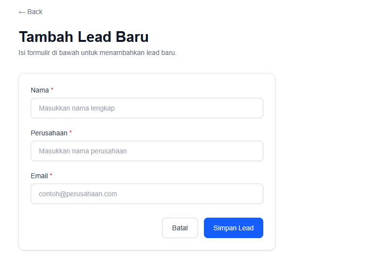
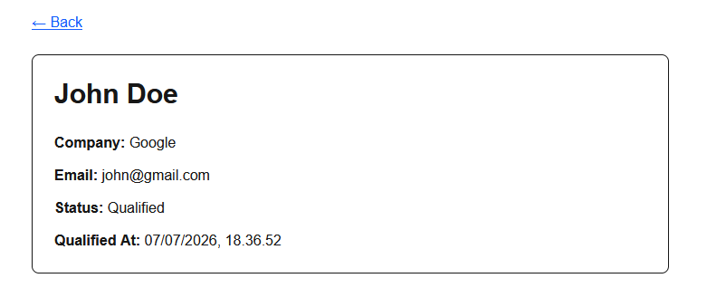
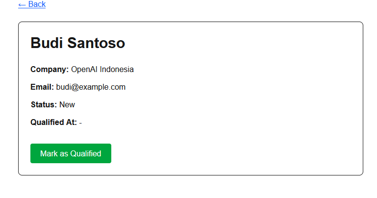

# Salesforce Readiness - Live Coding Exercise

## Deskripsi

Project ini merupakan implementasi sederhana fitur **Lead Management** menggunakan **Next.js (App Router)**.

Fitur yang tersedia:

* Menambahkan Lead baru.
* Melihat daftar Lead.
* Melihat detail Lead.
* Mengubah status Lead menjadi **Qualified**.
* Menyimpan tanggal dan waktu saat Lead diubah menjadi **Qualified**.

Data disimpan menggunakan file **JSON** sesuai ketentuan soal sehingga tidak memerlukan database.

---

## Gambar Insert


## Gambar Detail


## Gambar Update


---


# Cara Menjalankan Project

## Clone Repository

```bash
git clone <repository-url>
cd live-code
```

## Install Dependency

```bash
npm install
```

## Menjalankan Development Server

```bash
npm run dev
```

Buka browser:

```
http://localhost:3000
```

> Halaman awal (`/`) akan otomatis redirect ke `/leads`.

---

# Struktur Project

```
app/
├── api/
│   └── leads/
│       ├── route.ts          # GET (list), POST (create)
│       └── [id]/
│           └── route.ts      # GET (detail), PATCH (update status)
│
├── leads/
│   ├── page.tsx              # Daftar semua lead
│   ├── new/
│   │   └── page.tsx          # Form tambah lead baru
│   └── [id]/
│       └── page.tsx          # Detail lead
│
├── layout.tsx
└── page.tsx                  # Redirect ke /leads

components/
└── markqualifiedbutton.tsx   # Tombol Mark as Qualified (Client Component)

lib/
└── lead.services.ts          # Logic baca/tulis data leads.json

types/
└── lead.types.ts             # Interface Lead, LeadStatus, CreateLeadInput

data/
└── leads.json                # Penyimpanan data (pengganti database)
```

---

# API Endpoints

| Method | Endpoint          | Deskripsi                        |
|--------|-------------------|----------------------------------|
| GET    | `/api/leads`      | Ambil semua lead                 |
| POST   | `/api/leads`      | Tambah lead baru                 |
| GET    | `/api/leads/:id`  | Ambil detail lead berdasarkan id |
| PATCH  | `/api/leads/:id`  | Update status lead               |

---

# Asumsi yang Digunakan

* Data disimpan pada file `data/leads.json`.
* Tidak menggunakan database sesuai instruksi soal.
* Status Lead hanya terdiri dari:

  * `New`
  * `Contacted`
  * `Qualified`
* Ketika tombol **Mark as Qualified** ditekan, field `qualifiedAt` akan otomatis diisi menggunakan waktu saat proses dilakukan.
* Validasi input (nama, perusahaan, email) dilakukan di sisi API sebelum data disimpan.
* Endpoint API hanya digunakan untuk kebutuhan CRUD sederhana.

---

# Hal yang Belum Sempat Dikerjakan

* Pagination pada daftar Lead.
* Fitur pencarian dan filter berdasarkan status.
* Konfirmasi sebelum mengubah status menjadi Qualified.
* Unit Testing dan Integration Testing.
* Penyimpanan menggunakan database (misalnya PostgreSQL atau MySQL).
* Autentikasi dan otorisasi pengguna.
* Tampilan UI yang lebih menyerupai Salesforce Lightning Design System (SLDS).

---

# Salesforce Readiness

Berdasarkan pemahaman saya, implementasi pada Salesforce kemungkinan menggunakan:

* Standard Object **Lead**
* Picklist untuk Status
* Custom Field `Qualified At`
* Salesforce Flow untuk mengisi tanggal saat status berubah menjadi Qualified
* Lightning App Builder untuk halaman
* Lightning Web Component apabila diperlukan UI khusus
* Apex apabila terdapat business logic yang lebih kompleks


# Pembelajaran saya jawab di file
    * Implementasi Selesforce.txt
    * Learning Notes.txt
